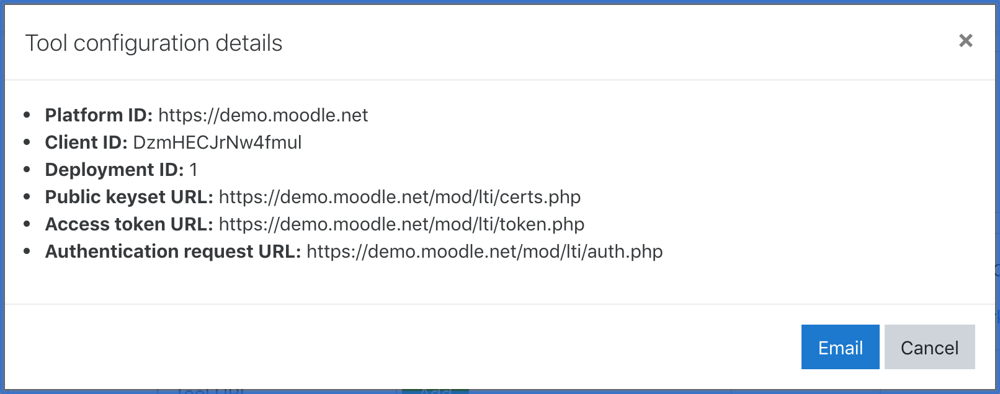

# LTI 1.3 Compliant NodeJS Library for External Tool Integration

[](https://opensource.org/licenses/MIT)

This Javascript-based Library allows an education provider to integrate web-based external Tools into their chosen learning Platform, such as Moodle, Blackboard, Edgenuity, etc, without needing to understand the underlying Learning Tools Interoperability (LTI) standards (https://www.imsglobal.org/activity/learning-tools-interoperability). 

This Library supports the LTI 1.3 Core standards, which implements up-to-date privacy and security standards.  It also provides limited support the Assignment and Grade Services.

In the future, this Library will be updated to fully support the LTI Advantage extensions for Assignments/Grades.  At this time, LTI Advantage Names and Roles Provisioning Services and Deep Linking is not supported.

## Overview

Follow these steps to implement this Library:

0. [Develop a Tool](#develop-a-tool)
2. [Install Library](#install-library)
3. [Setup Server and Routes](#setup-server-and-routes)
4. [Setup MongoDB](#setup-mongodb)
5. [Add Tool to Platform](#add-tool-to-platform)
6. [Register Platform with Tool](#register-platform-with-tool)
7. [Run your Server](#run-your-server)


Optionally, you can:

1. Use Example Tool (https://github.com/SanDiegoCodeSchool/lti-node-example)
2. View the OIDC Tool Launch Flow (see the related 'lti-node-example' repo for this)
3. Use the Test Suite
4. View the Glossary

### Develop a Tool

It is assumed if you are interested in integrating a Tool into a Platform, that you have already developed a working Tool.  If not, Step 0 is to develop your Tool that will be dropped into a learning Platform.  If you are not at that point yet, you can use the Example Tool related to this Library.

### Install Library

To install this Library, use the Node Package Manager (NPM) and run in your terminal:

```
npm install node-lti-v1p3
```

### Setup Server and Routes

This library requires the use of an Express server.  Setup a basic Express server add middleware, and routes within your server.js file to launch your Tool.  You can refer to the server.js example file in our Example Tool.

In addition, add the following to your server:

*Middleware to store session information*
```
app.use(session({
  name: 'lti_v1p3_library',
  secret: 'iualcoelknasfnk',
  saveUninitialized: true,
  resave: true,
  secure: true,
  ephemeral: true,
  httpOnly: true,
  store: new MongoStore({ mongooseConnection: mongoose.connection })
}));
````

*Route to Handle OIDC Login Requests*
```
app.post('/oidc', (req, res) => {
  create_oidc_response(req, res);
});
```

*Route to Handle Tool Launches, 'route to add to Base URL' can be an empty string if unneeded*
```
app.post('/project/submit', (req, res) => {
    launchTool(req, res, < route to add to Base URL, if any >);
});
```

*Route to send score back to Platform*
```
app.post('/auth_code', (req, res) => {
  if (!req.body.error) {
    send_score(req, req.session.grade, < maximum grade allowed >);
  } else {
    res.status(401).send('Access denied: ' + req.params.error);
  }
});
```

*Within your Tool's route where grading is performed, set up the score to be returned to the Platform.*
This initiates the score submission, which will end at the above /auth_code route where the score is finally sent
```
  req.session.grade = < student's grade >;
  res.redirect(307, prep_send_score(req));
```

*Route to return from Tool to Platform*
```
app.post('/project/return', (req, res) => {
  res.redirect(req.session.decoded_launch["https://purl.imsglobal.org/spec/lti/claim/launch_presentation"].return_url);
  req.session.destroy();
});
```

### Setup MongoDB

This library requires MongoDB.  If you do not currently have MongoDB setup, follow these instructions.

* MacOS - use homebrew: https://docs.mongodb.com/master/tutorial/install-mongodb-on-os-x/
* Windows - use the installer from here: https://docs.mongodb.com/master/tutorial/install-mongodb-on-windows/
* Linux - choose your flavor to install here: https://docs.mongodb.com/master/administration/install-on-linux/

Add the following to your server.js file:
```
mongoose.connect('mongodb://localhost:27017/TESTLTI', {
  useNewUrlParser: true, 
},
  (err) => {
    if(err) {
      return console.log(err);
    }
});
mongoose.Promise = Promise;
```

### Add Tool to Platform

Within the Platform, the Site Administrator needs to setup the External Tool.  For example, in Moodle s/he goes to Site Administration->Plugins->External Tool->Manage Tools.  At a minimum, the following fields should be setup:

- Tool's Name
- Tool's Base URL <Tool Base URL>
- Tool's Description, if desired
- Mark the tool as a 'LTI1.3' Tool
- Tool's Public Key -- you will need to come back and add this in a moment, see below about obtaining your Public key
- Initiate Login URL - < Tool Base URL > + '/oidc'
- Redirection URIs - all of the endpoints that may be used, for example < Tool Base URL >/project/submit
- Enable Assignment and Grade Services, if Tool should send grades to Platform
- Enable sharing of launcher's name, if Tool should have ability to display this information
- Choose 'Always' Accept grades from the Tool, if Tool should send grades to Platform  

After saving the External Tool, the Platform will assign a Client ID to the Tool and provide endpoints.  Make note of all of this information as it will be used in Step 5.  

The next step will be to add the Tool to course(s).  This can be done by an Administrator or a Teacher.  In Moodle, the steps are to navigate the appropriate course and use the Gear icon to `Turn editing on`.  You will then be able to `Add an Activty or Resource` for an `External Tool`.  Simply give it a name and select the Tool you added above from the drop down box for `Preconfigured tool`.  Click `Save and return to course`.

### Register Platform with Tool

In order register a Platform with the Tool, add a call to `registerPlatform` in your server file, with the values you received from Step 4.  For reference, here is a screenshot from the Moodle sandbox showing these values:


```
registerPlatform(
  consumerUrl, // Base url of the Platform (1st line on screenshot - Platform ID from Moodle). 
  consumerName, // Domain name of the Platform, e.g., moodle
  consumerToolClientID, // Client ID generated upon configuration of an external tool on the platform. (2nd line on screenshot) 
  consumerAuthorizationURL, // URL that the Tool sends Authorization Requests/Responses to. (6th line on screen shot, Authentication request URL) 
  consumerAccessTokenURL, // URL that the Tool can use to obtain an access Tokens. (5th line on screen shot, Access Token URL) 
  consumerRedirectURL // Tool's base URL PLUS slash route where Example Tool is served from. e.g., locally: '<LOCALTUNNEL SUB DOMAIN>' // cloud: 'https://node-lti-v1p3.herokuapp.com/'  PLUS '/project/submit'
  consumerAuthorizationconfig, // WILL always be an object with two properties: Authentication method and key for verifying messages from the Platform. (method will be "JWK_SET" and key will be on 4th line of screen shot, Public keyset URL) 
);
```
For example:
```
registerPlatform(
  'https://demo.moodle.net',  
  'moodle',
  'BMe642xnf4ag3Pd',
  'https://demo.moodle.net/mod/lti/auth.php',
  'https://demo.moodle.net/mod/lti/token.php', 
  'https://piedpiper.localtunnel.me/project/submit',
  { method: 'JWK_SET', key: 'https://demo.moodle.net/mod/lti/certs.php' }
);
```

### Run your Server

Once the Tool is integrated with the Platform, your server must be up and running so that the Tool can be accessed. In a development environment, start your MongoDB and your server in separate terminals:

```
mongod
npm start
```

Now that your server is running, you are able to access the Tool's generated Client Public key by making a GET request with `<your base URL>` as a parameter to `<your base URL>/publickey`.  This key must be put into the Tool's Public Key field in Step 4 above on the Platform.  

---

### Optional Activities

#### Test Suite

The Library provides a test suite to verify portions of the basic functionality.  

To launch the automated tests for this Library, run in separate terminals:

```
mongod
npm test
```

---

#### Glossary

JWT - JSON Web Tokens (JWTs) are an open, industry standard that supports securely transmitting information between parties as a JSON object.  Signed tokens can verify the integrity of the claims contained within it.  (https://openid.net/specs/draft-jones-json-web-token-07.html).  

LTI 1.3 - The IMS Learning Tools Interoperability specification ((https://www.imsglobal.org/spec/lti/v1p3)) allows Platforms to integrate external Tools and content in a standard way. As of 2019, LTI v1p3 is the latest standard.

LTI Advantage - Services (https://www.imsglobal.org/spec/lti/v1p3/impl) built on top of LTI 1.3 for:
* Assignment and Grades Services - (https://www.imsglobal.org/spec/lti-ags/v2p0)
* Names and Roles Provisioning Services (https://www.imsglobal.org/spec/lti-nrps/v2p0/)
* Deep Linking Services (https://www.imsglobal.org/spec/lti-dl/v2p0/)

LTI v1.3 and the LTI Advantage - together this set of services incorporate a new model for secure message and service authentication with OAuth 2.0. (https://www.imsglobal.org/activity/learning-tools-interoperability)

LMS - Learning Management System.  Referred to as Platforms in this document.

OAuth 2.0 - LTI 1.3 specifies the use of the OAuth 2.0 Client Credential Grant mechanism to secure web services between trusted systems.  This Library makes use of JSON Web Tokens, JWT, for the access tokens. (https://www.imsglobal.org/spec/security/v1p0) 

OIDC - OpenID Connect is a simple identity layer on top of the OAuth 2.0 protocol. It allows Clients to verify the identity of the End-User based on the authentication performed by an Authorization Server, as well as to obtain basic profile information about the End-User in an interoperable and REST-like manner.  https://openid.net/connect/

Platform - previously referred to as the Tool Consumer is the Learning Management System (LMS) that the educational provider is using.  Examples are Moodle, Blackboard, Edgenuity, Canvas, Schoology, etc.

Tool - previously referred to as the Tool Provider, this is the external Tool that contains educational material to include in a course.  Tools can range from a single piece of content, for example a quiz, to an extensive interactive website featuring specialized course content.

---

#### Contributors
* Argenis De Los Santos
* Gian Delprado
* Godfrey Martinez
* Michael Roberts
* Sherry Freitas

---

#### Keywords

LTI LMS Tool LTIv1.3 Node/Express Javascript
